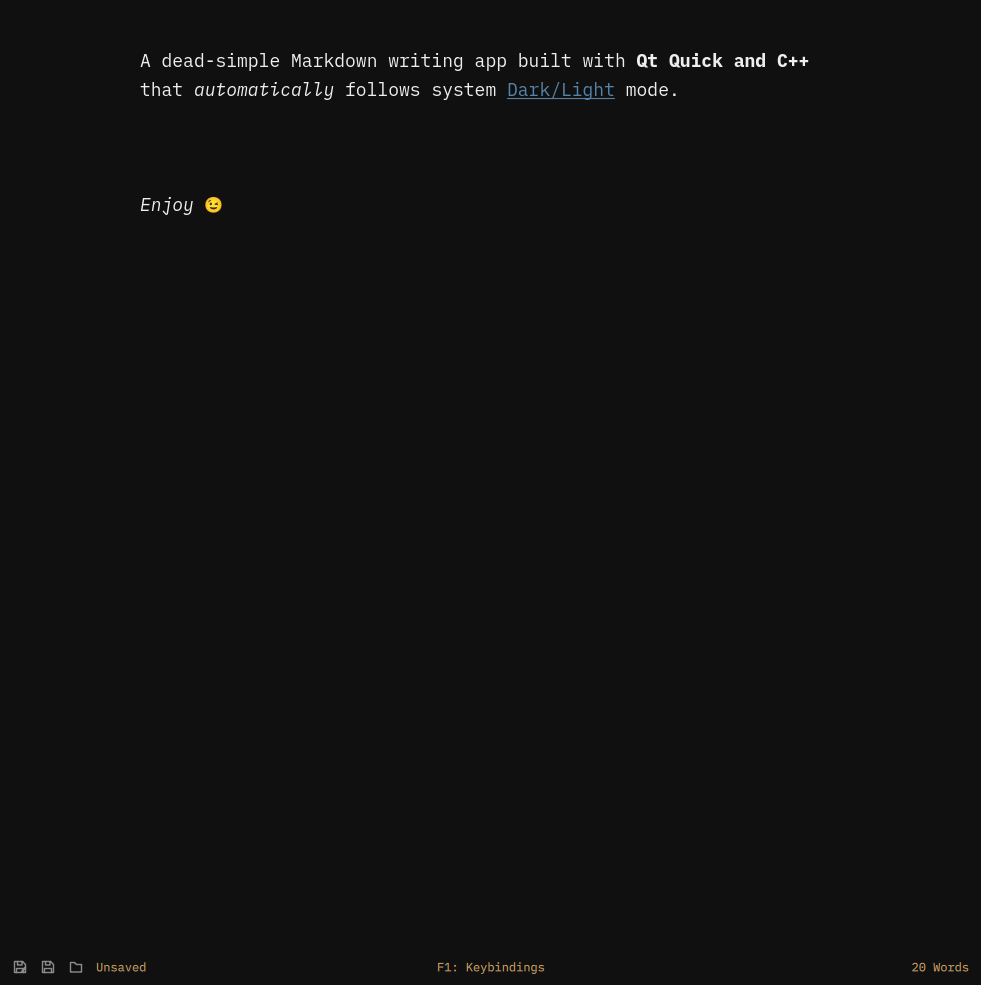
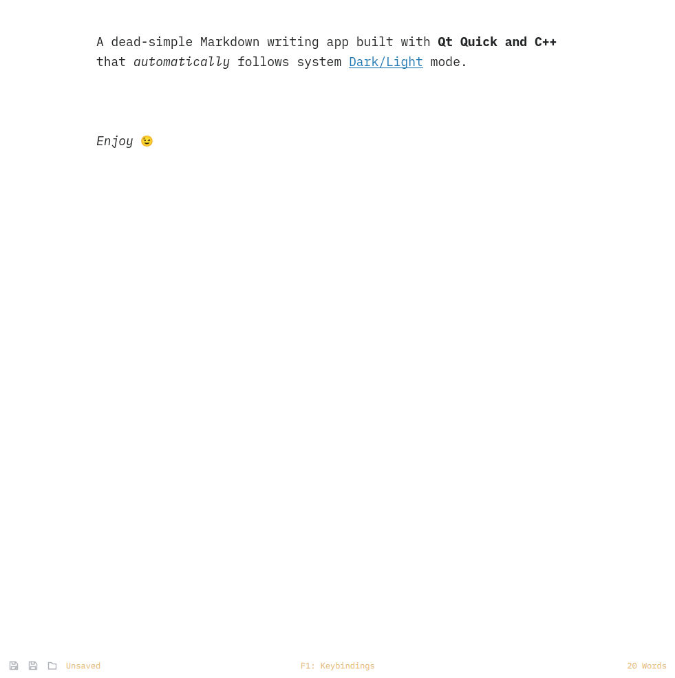

# Omawrite

My fork of [Omawrite](https://github.com/omacom-io/omawrite).





## Enhancements

- Reliable keyboard shortcuts with an in-app reference.
- Improved saving, opening, recovery, and file-conflict handling.
- Refined typography and a responsive footer for tiled and windowed use.
- Consistent light and dark presentation.

## Install

Install the `omawrite` package from the Omarchy Package Repository. Omawrite
is installed by default on new Omarchy installations from Quattro onward.

To build and install this fork on an Arch-based system:

```sh
git clone https://github.com/Abs313a/omawrite.git
cd omawrite
./bin/install
```

## Shortcuts

- `Ctrl+S` saves.
- `Ctrl+Shift+S` saves as.
- `Ctrl+O` opens a Markdown file.
- `Ctrl+P` opens the system print dialog.
- `Ctrl+N` opens a new Omawrite window.
- `Ctrl+Z` undoes and `Ctrl+Shift+Z` redoes.
- `Ctrl+F` searches. Use `Enter` or `Ctrl+G` for the next match and
  `Shift+Enter` for the previous match.
- `Ctrl+H` opens find and replace.
- `Ctrl+B`, `Ctrl+I`, and `Ctrl+K` insert bold, italic, and link Markdown.
- `F11` toggles fullscreen.
- `F1` shows the keyboard shortcut reference.

## Supported environments

Omawrite supports Wayland, X11/XCB, and XWayland from the same Qt build.

## Requirements

- Qt 6: `qt6-base`, `qt6-declarative`, `qt6-quickcontrols2`
- `xdg-desktop-portal` and a portal backend

The iA Writer Mono font is bundled under the SIL Open Font License 1.1; see
`fonts/OFL.txt`. The font is copyright Information Architects Inc. and based
on IBM Plex, copyright IBM Corp.
